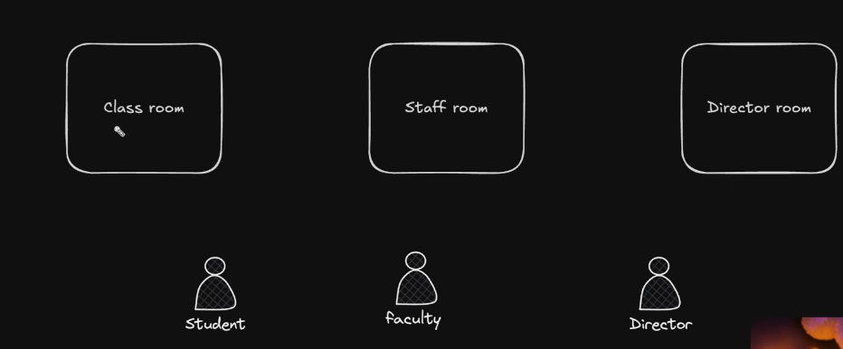
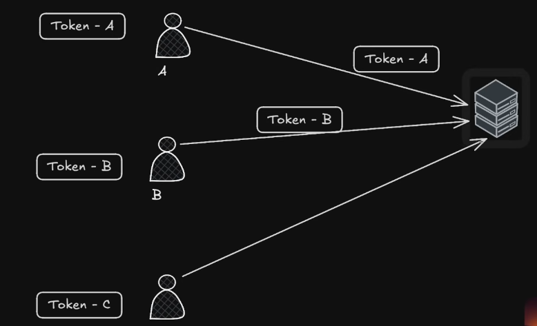
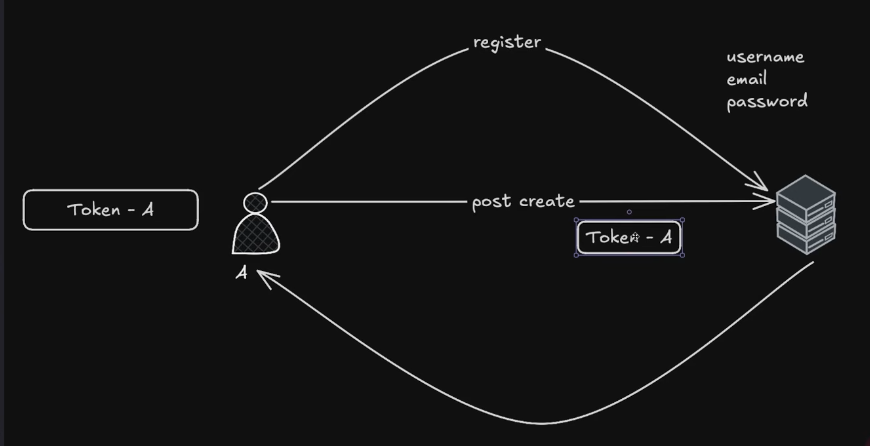

# Authentication
1. validation -> format shi hai ya nhi
2. verification -> data shi hai ya nhi
3. Authentication -> from where it is coming from  a, b, c, ....
4. Authorization ->  which user  can acess what

# Api
we doon't create api in app.js 
 in routes we crreate api. (auth.routes.js)
 in routes we don't logic or code in auth.routes.js 
 we create controller forlder in which we create logic or code of 
 api's like auth.controller
 # cookies
 A cookie is a small piece of data that the server sends to the browser, and the browser stores it and sends it back with future requests to the same server.
 How cookies work
1. User logs in
Backend
res.cookie("token", "abc123");
Server sends:
Set-Cookie: token=abc123
2. Browser stores the cookie
token=abc123
3. Future requests
Browser automatically sends:
Cookie: token=abc123

Backend can read it and identify the user

Install: npm install cookie-parser